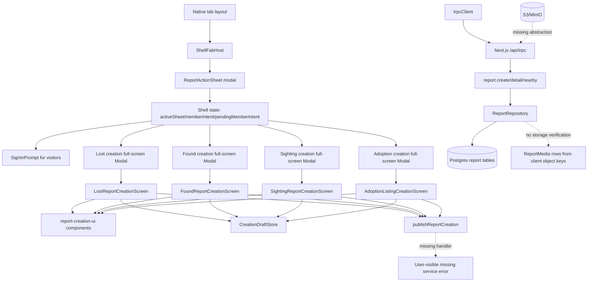
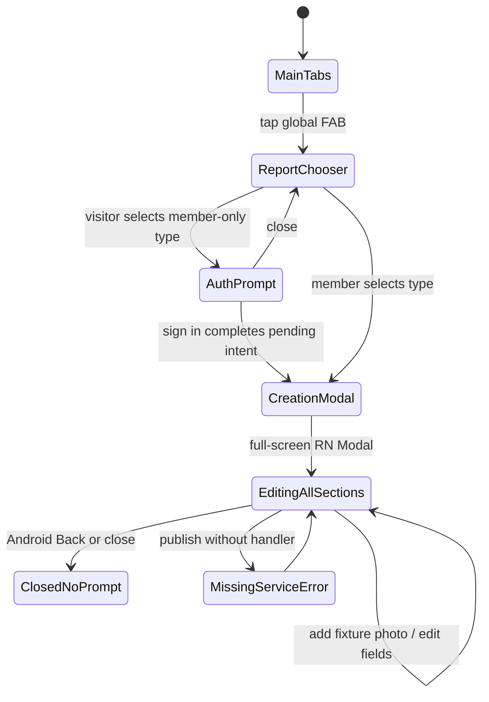
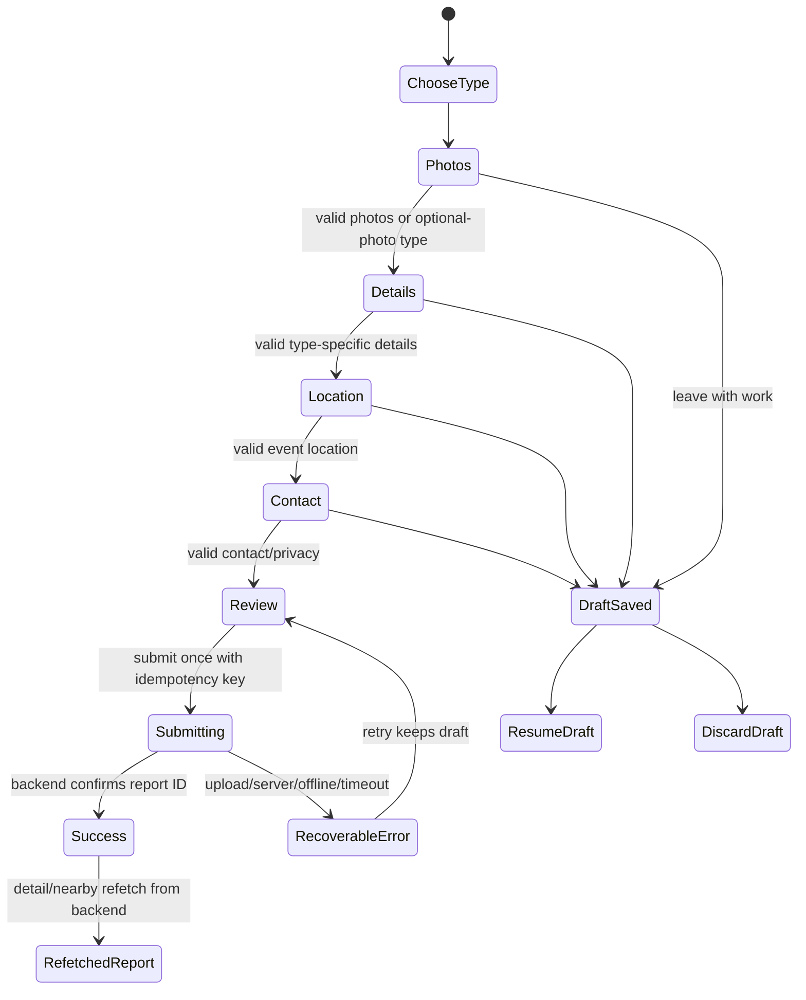

# Report creation audit

Status: Stage 0 reconnaissance complete on 2026-06-21. RC-001 and RC-003 implementation checkpoints are ready for human/device verification; the full report-creation mission is not complete.

This document records the current report-creation journey before production fixes. The screenshots under
`.scratch/mobile-qa/20260621-130941/` are defect evidence, not a design target.

## Environment

- Workspace: `/home/z/Personal/ai/rastro`
- Device: Android emulator `emulator-5554`, package `bo.rastro.app`
- Viewport: `1080x2400`, density `420`, Android `16`
- App launch: documented Expo dev-client flow with `EXPO_PUBLIC_API_BASE_URL=http://10.0.2.2:3000`
- Backend probe: `http://127.0.0.1:3000/api/auth/get-session` returned `200 null`
- Node warning during tests: repo asks for `^22.21.0`; local runtime was `v24.11.1`

## Commands executed

```sh
pnpm -F @acme/expo test
pnpm -F @acme/api test
pnpm -F @acme/db test
pnpm -F @acme/validators test
pnpm -F @acme/expo exec expo config --type public
curl -i http://127.0.0.1:3000/api/auth/get-session
EXPO_PUBLIC_API_BASE_URL="http://10.0.2.2:3000" pnpm -F @acme/expo exec expo start --dev-client --clear
adb shell pm clear bo.rastro.app
adb shell uiautomator dump
adb exec-out screencap -p
adb logcat -v time ReactNativeJS:V Expo:V AndroidRuntime:E '*:S'
```

Test status during reconnaissance:

- `@acme/expo`: 45 files, 217 tests passed
- `@acme/api`: tests passed with one skipped test
- `@acme/db`: 1 file, 3 tests passed
- `@acme/validators`: 3 files, 7 tests passed

Implementation checkpoint verification on 2026-06-21:

- `pnpm -F @acme/expo test && pnpm -F @acme/expo typecheck && pnpm -F @acme/expo lint`: 47 files, 227 tests passed; typecheck/lint passed.
- `pnpm -F @acme/api test && pnpm -F @acme/api typecheck && pnpm -F @acme/api lint`: 4 passed and 2 integration-gated skipped files; 23 passed and 2 skipped tests; typecheck/lint passed.
- `pnpm -F @acme/db test && pnpm -F @acme/db typecheck && pnpm -F @acme/db lint`: 1 file, 4 tests passed; typecheck/lint passed.
- `pnpm -F @acme/validators test && pnpm -F @acme/validators typecheck && pnpm -F @acme/validators lint`: 3 files, 8 tests passed; typecheck/lint passed.
- `pnpm -F @acme/nextjs test && pnpm -F @acme/nextjs typecheck && pnpm -F @acme/nextjs lint`: 9 files, 26 tests passed; typecheck/lint passed.
- `pnpm -F @acme/expo format`, `pnpm -F @acme/api format`, `pnpm -F @acme/db format`, `pnpm -F @acme/validators format`, and `pnpm -F @acme/nextjs format`: passed.
- `pnpm exec fallow audit --base HEAD --format json --quiet 2>/dev/null || true`: verdict `pass`; remaining findings are inherited.

Implemented checkpoint scope:

- RC-001: the sighting creation flow now uses a backend-backed publish adapter with idempotency, duplicate-tap protection, backend confirmation, and ISO date-time validation before submit.
- RC-003: report media now uses backend-owned S3/MinIO upload sessions, pending/ready/failed/removed media state, ready media ID submission, object metadata verification, expiry refresh, storage docs, and a protected cleanup job route.

Remaining P0/P1 work:

- RC-002 image picker/crop/edit/reorder/upload client is not implemented.
- RC-004/RC-005 canonical journey state and stack navigation/safe-area repair are not implemented.
- RC-007 chooser icon/safe-area/accessibility repair is not implemented.
- RC-008 report location picker is not implemented.
- RC-009 draft resume/discard and interrupted-upload recovery are not implemented.
- RC-010 lost/found/adoption end-to-end submission with ready media IDs is not implemented.
- RC-011 large-text/screen-reader/device verification is not complete.
- Real device/emulator verification against reachable MinIO/AWS-compatible storage has not run in this checkpoint.

## Runtime evidence index

| Evidence                                                                               | Finding                                                                                                                                                         |
| -------------------------------------------------------------------------------------- | --------------------------------------------------------------------------------------------------------------------------------------------------------------- |
| `.scratch/mobile-qa/20260621-130941/screenshots/03-report-chooser.png`                 | Member report chooser shows Android text fallbacks such as `!`, `OK`, `o`, `<3`, and `>` instead of intentional icons.                                          |
| `.scratch/mobile-qa/20260621-130941/screenshots/22-clean-nearby-chooser.png`           | Clean visitor chooser from the Nearby tab shows the same placeholder icon behavior.                                                                             |
| `.scratch/mobile-qa/20260621-130941/screenshots/01-launch.png`                         | A sighting creation modal can render with visible validation errors on first view and a header close control close to the status bar.                           |
| `.scratch/mobile-qa/20260621-130941/screenshots/02-after-back.png`                     | Android system Back dismisses the creation modal without an unsaved-work prompt.                                                                                |
| `.scratch/mobile-qa/20260621-130941/screenshots/04-lost-creation.png`                  | Lost report screen shows details content while later steps are also visually prominent.                                                                         |
| `.scratch/mobile-qa/20260621-130941/screenshots/05-found-creation.png`                 | Found report screen shows initial validation errors before user interaction.                                                                                    |
| `.scratch/mobile-qa/20260621-130941/screenshots/07-adoption-creation.png`              | Adoption creation shows several steps as completed/current while the visible form is the pet step; review is not represented in the first four displayed steps. |
| `.scratch/mobile-qa/20260621-130941/screenshots/09-lost-photos-section.png`            | Photo section promises camera/photo flow but only shows a local add tile and immediate required-photo error.                                                    |
| `.scratch/mobile-qa/20260621-130941/screenshots/10-lost-photo-after-add.png`           | Tapping add photo inserts a fixture/local preview; no native picker, camera, crop, metadata, upload, or permission prompt appears.                              |
| `.scratch/mobile-qa/20260621-130941/screenshots/12-lost-submit-missing-handler.png`    | Publish fails with "servicio no esta disponible"; no backend call or storage call is observed in filtered logcat.                                               |
| `.scratch/mobile-qa/20260621-130941/screenshots/23-clean-visitor-lost-auth-prompt.png` | Visitor selecting a report type opens the auth prompt; creation does not start until member intent is promoted after sign-in.                                   |

## Current route and state inventory

### Entry points

- Global FAB is rendered from `ShellFabHost` inside `apps/expo/src/app/(tabs)/_layout.tsx`.
- The FAB is visible on main tab segments from `shouldShowGlobalFabForSegments` and hidden for visitors on Activity by `shouldDisplayGlobalReportFab`.
- Supported report actions are defined in `apps/expo/src/features/shell/shell-model.ts` as lost, found, sighting, and adoption.
- `chooseReportIntent` in `apps/expo/src/features/shell/shell-provider.tsx` either promotes a member intent immediately or opens auth for visitors.

Observed entry points:

- Member-like state from Activity: chooser opened.
- Clean visitor from Nearby: chooser opened and selecting Lost opened auth prompt.
- Clean visitor from Activity: FAB was hidden by policy.

### Chooser

- Component: `ReportActionSheet` in `apps/expo/src/features/shell/shell-overlays.tsx`.
- Presentation: React Native transparent `Modal`, not a route.
- Dismissal: backdrop press and Android Back via `onRequestClose`.
- Icons: `ShellIcon` uses SF Symbols on iOS and text fallbacks on Android.
- Dismiss and navigate behavior: the sheet closes by setting `activeSheet: null`; creation starts by setting `memberIntent`.

### Creation screens

All four report types are rendered as full-screen React Native modals from `ShellFabHost`, not as Expo Router stack routes:

- Lost: `LostReportCreationModal` -> `LostReportCreationScreen`
- Found: `FoundReportCreationModal` -> `FoundReportCreationScreen`
- Sighting: `SightingReportStartModal` -> `SightingReportCreationScreen`
- Adoption: `AdoptionListingCreationModal` -> `AdoptionListingCreationScreen`

Each modal uses `presentationStyle="fullScreen"` and `onRequestClose={onClose}`. The root Expo Router stack has `headerShown: false`, so the creation journey has no native stack header or route-level unsaved-change prevention.

### Current UI state model

Each type-specific view model returns an array of steps with only `isComplete`. The shared progress component:

- receives `steps`
- renders `steps.slice(0, 4)`
- styles a step as prominent when `step.isComplete`
- has no `currentStep`, no completed/current/upcoming distinction, and no screen-reader step announcement

Observed effect: the visible content, header, and progress state can disagree. Adoption has six logical steps but only four are rendered.

### Forms

The current creation screens render multiple sections in a single scroll surface rather than a gated wizard:

- details/pet
- photos
- location
- contact
- review
- success after local publish state

Validation errors are computed by the view model and displayed whenever `error` exists. There is no field-level touched state, blur state, attempted-step state, or first-invalid-field focus/scroll behavior.

### Images

The production Expo app currently has `expo-image`, but it does not depend on `expo-image-picker`, `expo-image-manipulator`, camera APIs, or another crop/edit library.

Current image behavior:

- `addPhoto` appends a fixture from `*-creation-fixtures.ts` or a fallback from `createFallbackPhoto`.
- Found, sighting, and adoption fallback photos are local `file:///...` URIs.
- Lost fixture photos include remote sample images.
- Tapping an existing photo removes it.
- There is no native permission request, library picker, camera capture, crop result, rotate action, reorder action, primary image selection, preprocessing, real upload progress, retry, cancellation, or remote reload.

### Backend and persistence

Existing backend report creation:

- `packages/validators/src/index.ts` defines `createReportInputSchema`.
- `packages/api/src/router/report.ts` exposes protected `report.create`.
- `packages/api/src/report-repository.ts` creates `Report`, `ReportLocation`, and `ReportMedia` transactionally.
- `Report` has a unique `(caretakerId, idempotencyKey)` index.
- `report.nearby` and `report.detail` return persisted public reports.

Current gap:

- The mobile creation screens are not wired to `trpcClient.report.create`.
- The shell does not pass `onPublishLostReport`, `onPublishFoundReport`, `onPublishSightingReport`, or `onPublishAdoptionListing` into the modals.
- `publishReportCreation` therefore returns the missing-handler error in production UI.
- The backend accepts client-supplied media `objectKey` and optional `canonicalUrl`.
- There is no upload-session table, pending-media ownership state, object-storage adapter, presigned URL endpoint, HEAD/stat verification, orphan cleanup job, or S3/MinIO configuration in `.env.example`.

### Drafts and recovery

Existing draft support:

- `useDurableCreationDraft` loads and saves drafts through a `CreationDraftStore`.
- `creation-drafts.ts` stores schema version `1`.

Gaps:

- No explicit Resume/Discard UI is shown before restoring a draft.
- Draft save is immediate on every draft change after load, not debounced.
- Incompatible drafts are silently ignored instead of being explained.
- Draft state does not include real upload session state, ready media IDs, retry state, or reconciliation of already uploaded media.

## Dependency map



## Current state diagram



Target state for repair:



## Defect matrix

| ID     | Severity | Report type / step                    | Entry point                     | Evidence                                                                                                 | Root cause                                                                                                                                                                                      |
| ------ | -------- | ------------------------------------- | ------------------------------- | -------------------------------------------------------------------------------------------------------- | ----------------------------------------------------------------------------------------------------------------------------------------------------------------------------------------------- |
| RC-001 | P0       | All / submit                          | Member creation modal           | `12-lost-submit-missing-handler.png`; no `report.create` or upload log entries                           | Confirmed: shell modals do not pass publish handlers; `publishReportCreation` returns missing-handler when handler is absent.                                                                   |
| RC-002 | P0       | Lost/found/adoption / photos + submit | All member creation paths       | `09-lost-photos-section.png`, `10-lost-photo-after-add.png`; package deps                                | Confirmed: production app has no native picker/cropper integration and no backend upload-session/storage architecture.                                                                          |
| RC-003 | P0       | Media persistence/security            | Backend report API              | `packages/validators/src/index.ts`, `packages/api/src/report-repository.ts`, `packages/db/src/schema.ts` | Confirmed: backend trusts client-supplied media object keys/URLs; no pending media ownership, presigned upload, HEAD/stat verification, or cleanup.                                             |
| RC-004 | P1       | All / progress and step content       | Creation modals                 | `04-lost-creation.png`, `05-found-creation.png`, `07-adoption-creation.png`                              | Confirmed: progress receives independent `isComplete` booleans and truncates to four steps; there is no canonical current step.                                                                 |
| RC-005 | P1       | All / navigation and safe area        | Creation modals                 | `01-launch.png`, `02-after-back.png`, UI XML close bounds                                                | Confirmed: creation uses disconnected full-screen RN modals over a root stack with hidden headers; Android Back closes without unsaved-change prevention.                                       |
| RC-006 | P1       | All / validation                      | Creation modals                 | `01-launch.png`, `05-found-creation.png`                                                                 | Confirmed: validation errors are rendered from view-model state on initial mount; no touched/attempted-step gating.                                                                             |
| RC-007 | P1       | All / chooser                         | Global FAB from Activity/Nearby | `03-report-chooser.png`, `22-clean-nearby-chooser.png`                                                   | Confirmed: Android icon implementation intentionally maps symbols to text fallbacks.                                                                                                            |
| RC-008 | P1       | All / location                        | Creation forms                  | creation screenshots and fixtures                                                                        | Confirmed: creation starts with fixture default locations and no real report-location picker handoff wired into the shell modal path.                                                           |
| RC-009 | P1       | All / drafts and recovery             | Creation modals                 | `use-durable-creation-draft.ts`, `creation-drafts.ts`                                                    | Confirmed: durable draft storage exists but lacks explicit Resume/Discard, debouncing, upload reconciliation, and user-facing incompatible-draft handling.                                      |
| RC-010 | P2       | All / review                          | Creation forms                  | `11-lost-review-before-submit.png`, `12-lost-submit-missing-handler.png`                                 | Confirmed: review summarizes local draft data and can show local/fixture photo counts; it cannot show verified remote media or backend report state.                                            |
| RC-011 | P2       | All / accessibility                   | Creation and chooser            | UI XML, screenshots                                                                                      | Confirmed: step progress has no accessible current/completed/upcoming values; photo actions use generic labels such as "Quitar foto". Screen-reader verification is still required after fixes. |

## Root-cause notes

### RC-001: missing production submit path

Confirmed. The shell renders creation modals at `apps/expo/src/features/shell/shell-overlays.tsx` but passes only close/session/draft props. Each creation screen can accept a publish callback, but the callback is undefined in production. The publish helper has a dedicated missing-handler branch, which is the exact error shown at runtime.

Acceptance test before editing:

- From a signed-in/member creation path, create a no-photo sighting report, tap Publish repeatedly during a delayed response, and observe exactly one `report.create` call, one persisted report ID, a clean `report.detail` refetch, and the new report appearing in the same nearby query used by the app.

### RC-002 and RC-003: media lifecycle is not implemented

Confirmed. UI add-photo actions append fixtures. Backend report creation can persist media metadata, but there is no server-owned upload protocol. Lost, found, and adoption require media by validator rule, so they cannot honestly pass end to end until storage upload sessions and ready media ownership exist.

Acceptance test before editing:

- Select two real device images, crop/edit them, upload through backend-issued short-lived object-storage instructions to a real MinIO/S3-compatible endpoint, complete upload verification server-side, submit using ready media IDs, clean-refetch the report, and render the same crop/order from remote storage.

### RC-004: contradictory step progress

Confirmed. Each view model builds completion flags independently. The shared progress component renders those flags as prominent dots and hides steps after the fourth. It cannot represent "exactly one current step".

Acceptance test before editing:

- For every report type and every journey state, assert exactly one current step, completed steps have a non-color-only completed treatment, future steps are inactive, and visible content/header/progress text agree.

### RC-005: disconnected navigation

Confirmed. Creation is not a route in the Expo Router stack and cannot use stack headers, route history, `usePreventRemove`, or platform back semantics. Android Back closes immediately via modal `onRequestClose`.

Acceptance test before editing:

- Start from each supported entry point, enter a report flow, navigate back/close/cancel with unsaved work, and verify either preserved draft or explicit discard confirmation without losing the previous tab/navigation state.

### RC-006: validation flood

Confirmed. Errors are calculated on initial render and shown directly by shared field/photo/review components.

Acceptance test before editing:

- Open each type from a clean draft and assert no required-field errors are visible until blur, Continue, or Submit; after failed Continue, the first invalid field is focused/scrolled into view and announced.

### RC-007: placeholder icons

Confirmed. `ShellIcon` maps SF Symbols to text on Android. The screenshots show these fallbacks in the chooser.

Acceptance test before editing:

- Open chooser on Android and iOS; all report actions render intentional icons from one icon family with Spanish labels, and no action depends on punctuation/text badges for meaning.

### RC-008: location picker gap

Confirmed. Creation screens default to fixture locations and optional callbacks for choosing location are not provided through shell modals. Nearby has an Expo location adapter and manual locations, but report creation does not expose a real event-location picker.

Acceptance test before editing:

- During creation, select or confirm an event location through the real location UI, persist exact/internal and public/approximate values, review them, submit, and refetch the stored location from the backend.

### RC-009: drafts and recovery gap

Confirmed. Draft storage exists, but recovery UX is incomplete and media/upload state cannot be reconciled.

Acceptance test before editing:

- Start a report, make meaningful changes, leave, reopen, choose Resume or Discard, and verify the resulting state is coherent. Interrupt an upload, restart, and retry only the failed image without losing completed fields or uploaded media.

## Proposed atomic issue slices for `$to-issues`

These are drafted as vertical slices in dependency order. Per the `$to-issues` process, they should be reviewed for granularity before publishing to `.scratch/`.

1. **RC-001 Persist a no-photo sighting report from the real creation flow**
   - Type: AFK
   - Severity: P0
   - Blocked by: none
   - Covers: submit once, backend ID, idempotency, clean refetch, nearby query confirmation for the one report type that can be valid without media.

2. **RC-007 Repair the report-type chooser icons, accessibility, safe areas, and duplicate selection**
   - Type: AFK
   - Severity: P1
   - Blocked by: none
   - Covers: every entry point, clear Spanish labels, intentional icons, backdrop/system back, one atomic selection.

3. **RC-004 Introduce one canonical report-creation journey state model**
   - Type: AFK
   - Severity: P1
   - Blocked by: RC-001 if submit path contracts are reused
   - Covers: one current step, gated validation, step restoration, review/edit return, type-specific step sequences.

4. **RC-005 Move creation into real stack navigation with safe Back/Close and unsaved-work prevention**
   - Type: AFK
   - Severity: P1
   - Blocked by: RC-004
   - Covers: stack routes, platform back, safe areas, keyboard-safe footer, return destination continuity.

5. **RC-008 Wire a real report location picker into creation**
   - Type: AFK
   - Severity: P1
   - Blocked by: RC-004 and RC-005
   - Covers: event location selection, permission/denial handling, public precision, review and backend persistence.

6. **RC-003 Add backend-owned media upload sessions for S3/MinIO**
   - Type: AFK
   - Severity: P0
   - Blocked by: storage endpoint/configuration availability for integration tests
   - Covers: env config, DB migration, presigned PUT, pending media ownership, complete/verify, expiry refresh, orphan cleanup, MinIO/AWS docs.

7. **RC-002 Build the native image manager and crop/upload lifecycle**
   - Type: AFK
   - Severity: P0
   - Blocked by: RC-003
   - Covers: permission, picker/camera, crop/edit, reorder, primary, remove, preprocessing, upload progress, retry, remote reload.

8. **RC-001/002 Complete lost, found, and adoption submission using ready media IDs**
   - Type: AFK
   - Severity: P0
   - Blocked by: RC-003 and RC-007
   - Covers: photo-required report types, type-specific fields, media ownership validation, clean refetch/restart.

9. **RC-009 Add explicit draft Resume/Discard and interrupted-work recovery**
   - Type: AFK
   - Severity: P1
   - Blocked by: RC-004 and RC-007
   - Covers: draft versioning/migration, unsaved-change UX, upload reconciliation, unknown submission result reconciliation.

10. **RC-011 Run accessibility, large-text, keyboard, and safe-area hardening across the repaired flow**
    - Type: AFK
    - Severity: P1
    - Blocked by: RC-004, RC-005, RC-007, RC-002
    - Covers: labels, focus order, progress announcements, screen-reader states, largest font scale, smallest viewport, gesture insets.

## Blockers and external dependencies

Full acceptance cannot be honestly claimed from the current codebase because these production dependencies are absent:

- A configured test MinIO/S3-compatible endpoint reachable by the emulator/physical device for direct signed upload.
- Backend storage env variables and secrets outside the mobile app.
- Backend S3/MinIO client dependency and upload-session endpoints.
- Expo/native media picker and image manipulation dependencies.
- An E2E runner or documented emulator flow for native picker/camera automation. Manual QA can cover the first pass, but the mission requires device E2E coverage.

## Non-goals for this repair

- Redesigning unrelated tabs or feeds except where they must refetch/display the newly created report.
- Making the object-storage bucket public to simplify delivery.
- Persisting local file URIs, fixture URLs, or expiring presigned URLs as canonical report media.
- Replacing backend persistence with client cache insertion.
- Adding multipart upload before measured report images require it.
